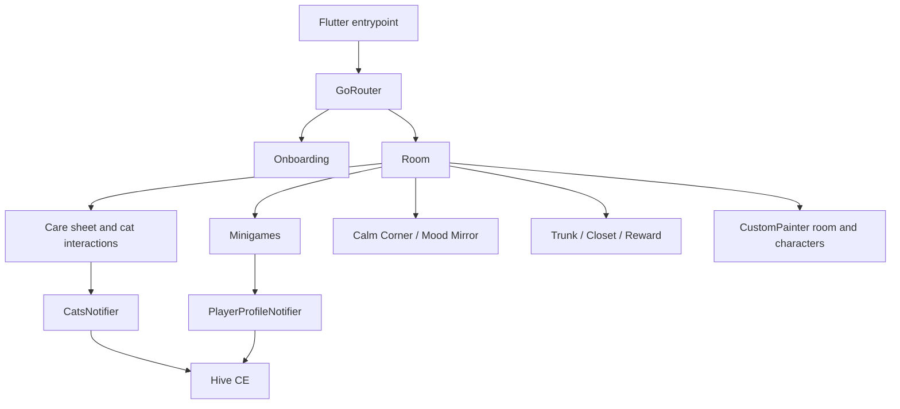

# System architecture

## Overview

The Flutter app is organized around a room-based child experience, feature screens for care, calming, rewards, and minigames, and shared state/services. Riverpod coordinates state, Hive CE persists player data, and GoRouter defines the navigable flow.

## Module boundaries

- `core/models`: persisted and derived domain models, including cat state, difficulty, profile, and rewards.
- `core/providers`: Riverpod notifiers for cats and player profile; `core/services` holds audio integration.
- `core/router`: route constants and app navigation.
- `features`: room, onboarding, five learning minigames, rewards, closet, trunk, and Calm Corner experiences.
- `shared/widgets`: reusable progress, sprite, and CustomPainter character presentation.

## Constraints

- State and persistence follow [[riverpod-hive-player-state-boundary]].
- Character presentation follows [[custom-painted-characters]].
- Product behavior must preserve [[child-safety-and-progression-constraints]].
- Web development behind the remote proxy follows [[development-proxy-base-path]].
