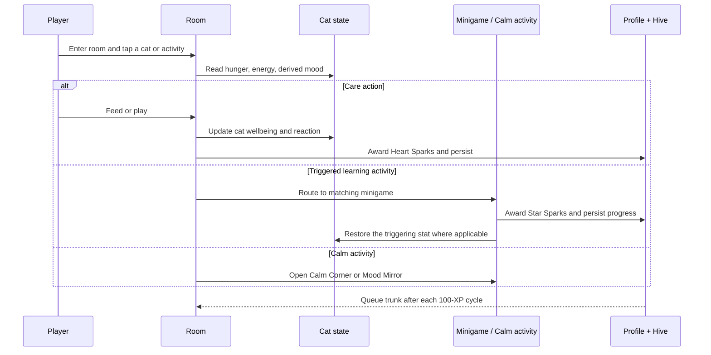

# Key flows

## Typical play flow

## Important flows

- Onboarding creates the local player profile and selects a difficulty tier.
- The room computes cat moods from hunger and energy; those moods surface prompts and gate relevant minigames.
- Completing care or learning awards XP into a single Purr-gress cycle. Each completed cycle makes a trunk available; opening it adds an inventory reward that may be equipped.
- Calm Corner remains available independently of cat state and provides lower-stimulation breathing, sensory play, and mood check-in experiences.
