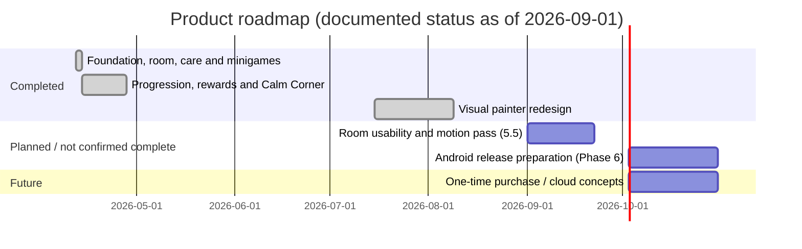

# Roadmap

## Milestones

Completed history is grounded in `project_state.md` and the April 2026 commits. The next detailed plan is a visual/usability pass documented in `Concept/dirac_plan.md`; this is planning evidence, not proof that the work is implemented.

## Next documented work

- Phase 5.5: improve room layout, child-sized controls, discoverability, reduced-motion behavior, and route transitions.
- Complete remaining content/release gaps: final audio, content externalization, parental gate, COPPA/accessibility work, landscape/release validation.
- Phase 6: Android release preparation, Play Store assets, performance profiling, and free-tier release.
- Phase 7 and cloud/dashboard concepts remain future scope.
